## Motivations


.center[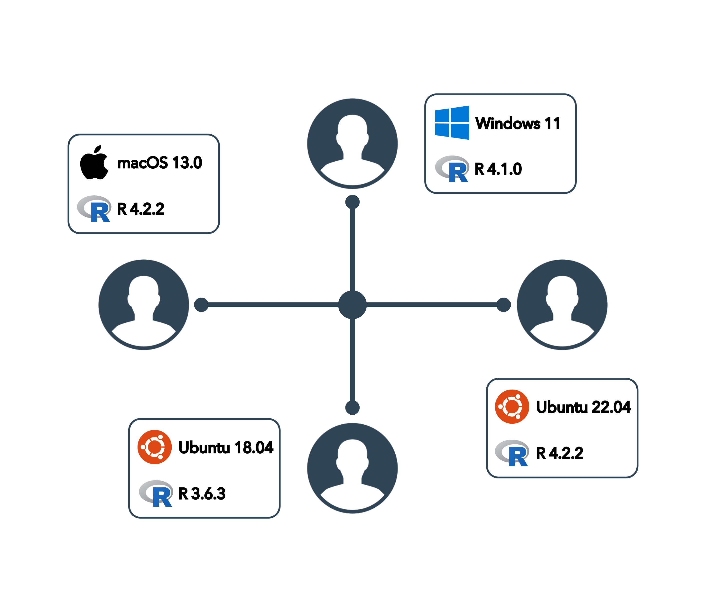]


---

## Motivations


.center[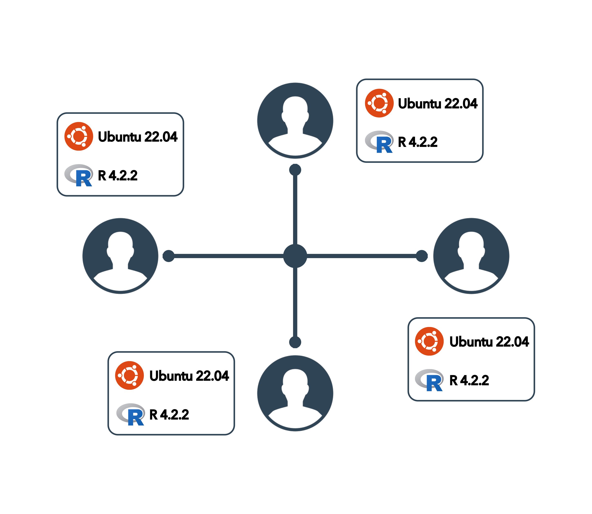]


---

## Motivations


.center[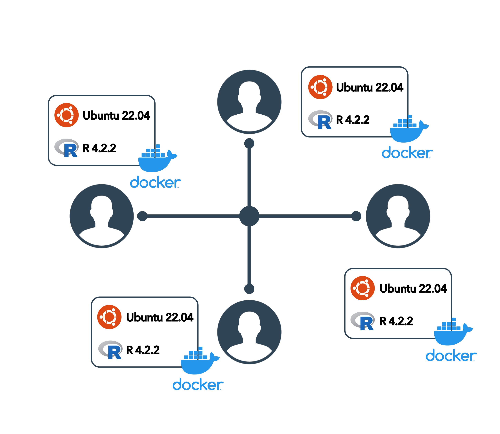]


---

## Docker en bref

.center[]


`r fontawesome::fa_i("hand-point-right", class = "dark")` &nbsp;Logiciel open source permettant de :

- empaqueter une application avec toutes ses dépendances système
- partager facilement un environnement de travail complet

--

<br />

`r fontawesome::fa_i("hand-point-right", class = "dark")` &nbsp;Un conteneur est _isolé_ du système hôte.
`r fontawesome::fa_i("docker")` permet donc de :

- tester des choses sans crainte d'endommager son système hôte
- utiliser différentes versions d'une librairie, d'un logiciel, etc.
- garder son système hôte propre, en installant tout sur Docker

--

> Idéal pour créer un environnement de developpement


---

## Virtualisation _vs._ Conteneurisation


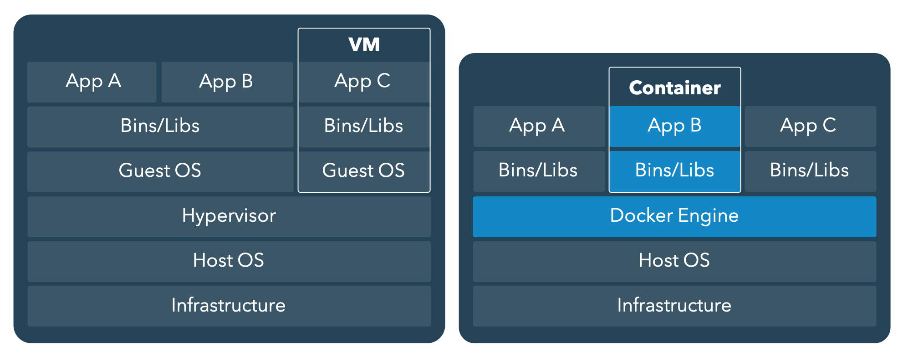

--

`r fontawesome::fa_i("hand-point-right", class = "dark")` &nbsp;**Avantages de la conteneurisation :**

- Extrêmement léger (exploitation du noyau Linux)
- Utilisation réduite de ressources (RAM, CPU)
- Déploiement simple et instantané


---

## La notion d'Image

> Tout **conteneur** est basé sur une **image** que l'on crée soi-même ou qu'on récupère depuis un site d'archivage

--

<br />

`r fontawesome::fa_i("hand-point-right", class = "dark")` &nbsp;Une **image `r fontawesome::fa_i("docker")`** est une sorte de conteneur figé : c'est un template **fixe** (une recette de cuisine) à partir duquel on créera un
ou des conteneurs. Une image est `immuable`.

<br />

--

`r fontawesome::fa_i("hand-point-right", class = "dark")` &nbsp;Un **conteneur `r fontawesome::fa_i("docker")`** est donc une instance (exécution) d'une image qui pourra être utilisée/modifiée une fois créée


---

## Docker Hub

Site d'archivage officiel : [**Docker Hub**](https://hub.docker.com)

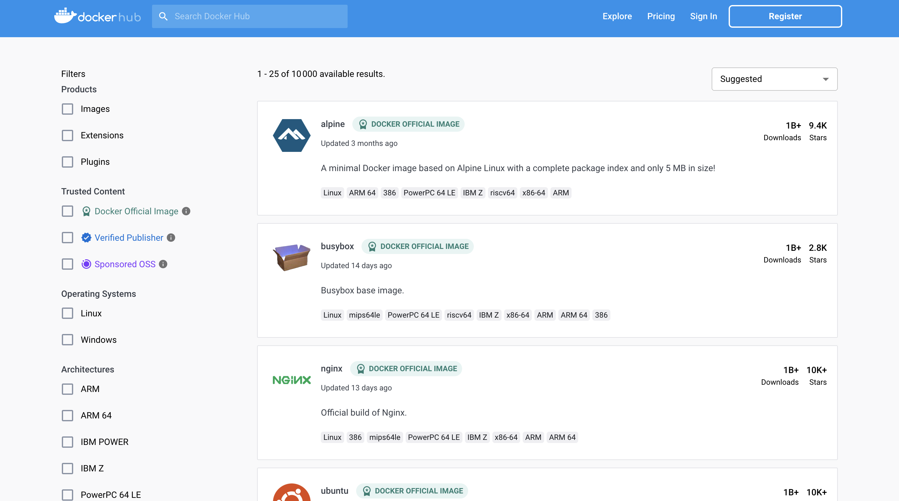


---

## Rocker project

Site officiel : [**https://rocker-project.org**](https://rocker-project.org/)


---

## Rocker project

Site officiel : [**https://rocker-project.org/images/**](https://rocker-project.org/images/)


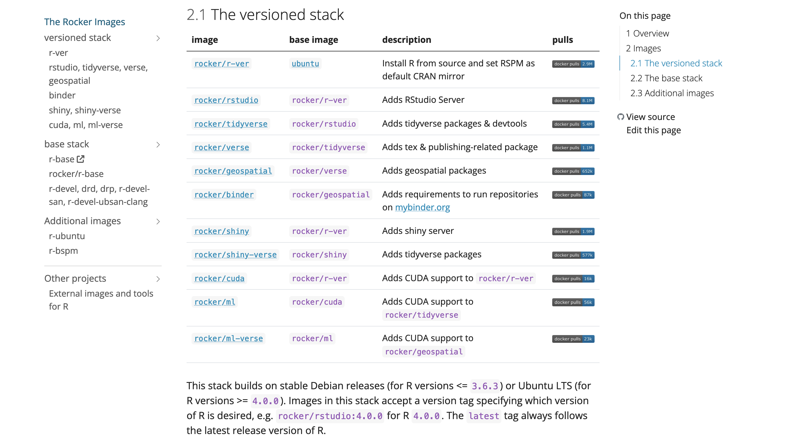


---

## Installation de Docker

[**https://docs.docker.com/get-docker**](https://docs.docker.com/get-docker/)


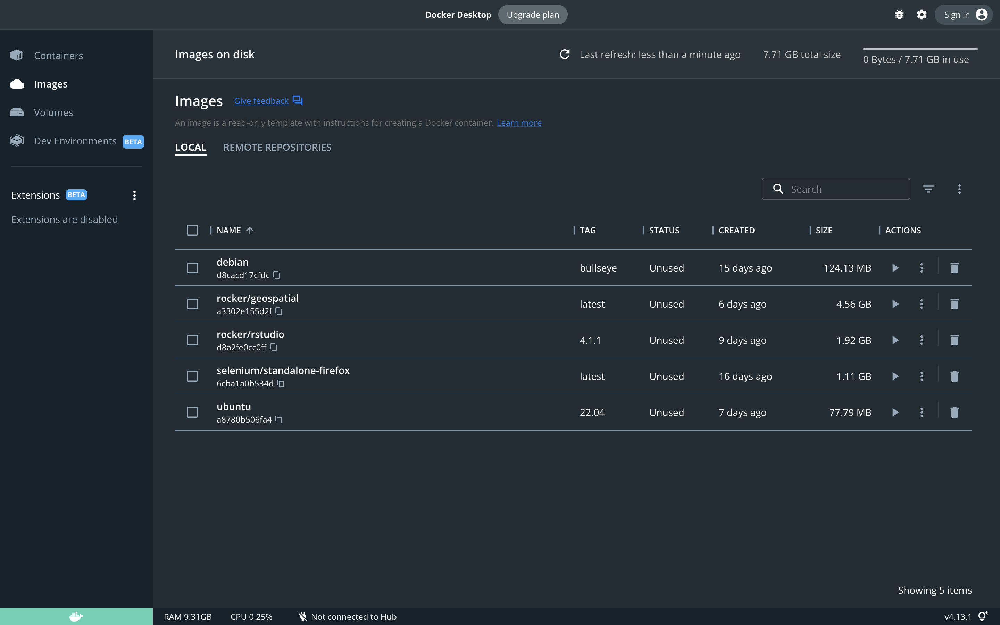

---

class: inverse, center, middle

## Mode Développement

---


## Création d'un conteneur - Dev


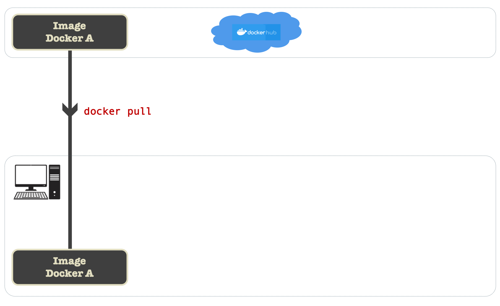

---


## Création d'un conteneur - Dev


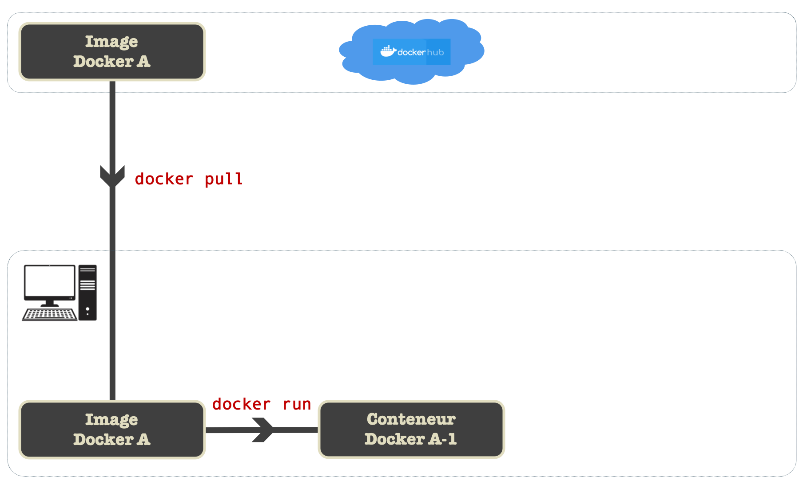


---


## Création d'un conteneur - Dev


- Téléchargement de l'image RStudio [`rocker/rstudio`](https://hub.docker.com/r/rocker/rstudio)

```sh
docker pull rocker/rstudio
```

<br />

--

- Téléchargement de l'image avec contrôle de la version de `r fontawesome::fa_i("r-project")` <br/>**(meilleure reproductibilité)**

```sh
docker pull rocker/rstudio:4.2.2
```

<br />

--

- Liste des images locales

```sh
docker images

# REPOSITORY                    TAG        IMAGE ID       CREATED       SIZE
# rocker/rstudio                4.1.1      d8a2fe0cc0ff   9 days ago    1.92GB
# rocker/rstudio                4.2.2      d110bab4d154   6 days ago    1.79GB
# rocker/rstudio                latest     d110bab4d154   6 days ago    1.79GB
```

---


## Création d'un conteneur - Dev

- Création d'un conteneur

```sh
docker run --rm                        # Delete the stopped container 
           -d                          # Daemon mode (run in background)
           -p 8787:8787                # Port mapping HOST:CONTAINER
           -e PASSWORD=yourpassword    # Password required (login: rstudio)
           rocker/rstudio:4.2.2        # Name of the image
```

<br />

--

- Sans authentification

```sh
docker run --rm -dp 8787:8787 -e DISABLE_AUTH=true rocker/rstudio:4.2.2
```

---


## Création d'un conteneur - Dev

- Dans un navigateur Web, visitez l'URL: <http://localhost:8787>

.center[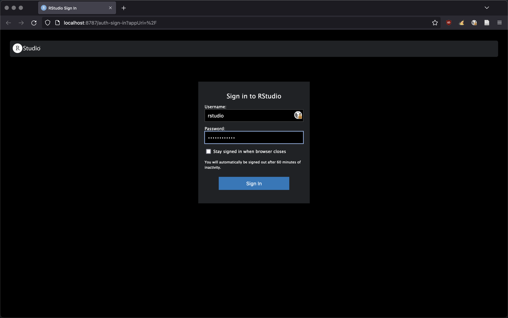<br/ >
.small[Password: `yourpassword`]]

---

## Création d'un conteneur - Dev

- Dans un navigateur Web, visitez l'URL: <http://localhost:8787>

.center[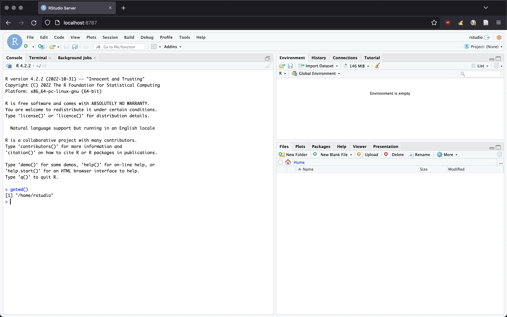]

---

## Gestion des conteneurs

- Liste des containeurs

```sh
docker ps

# CONTAINER ID   IMAGE                  COMMAND   CREATED         STATUS         PORTS                    NAMES
# baba86ace27a   rocker/rstudio:4.2.2   "/init"   7 seconds ago   Up 6 seconds   0.0.0.0:8787->8787/tcp   lucid_dubinsky
```

<br />

- Arrêt d'un containeur

```sh
docker stop baba86ace27a
```

<br />

- Suppression d'un containeur

```sh
docker rm baba86ace27a
```


---

## Quelques commandes utiles

```sh
## Images ----

docker search {{ IMAGE }}                              # Search for an image
docker pull {{ IMAGE }}                                # Download an image
docker pull {{ IMAGE }}:{{ TAG }}                      # ... with a specific version
docker images                                          # List local images
docker rmi {{ IMAGE }}:{{ TAG }}                       # Delete a local image

## Containers ----

docker run -it {{ IMAGE }}:{{ TAG }}                   # Start a new container
docker run -it --name "debbie" {{ IMAGE }}:{{ TAG }}   # ... with a custom name
docker run --rm -it {{ IMAGE }}:{{ TAG }}              # Delete after stopped
docker ps                                              # List containers
docker ps -a                                           # List containers (stopped included)
docker stop {{ CONTAINER }}                            # Stop a container
docker start {{ CONTAINER }}                           # Re(start) a container
docker rm {{ CONTAINER }}                              # Delete a container
docker stats                                           # Containers statistics
```


---

class: inverse, center, middle

## Persistance


---

## Persistance des données

Un conteneur est **isolé** et n'est **pas persistant** : 
tout ce qui est ajouté à l'intérieur (fichiers, logiciels, etc.) n'est pas 
accessible, par défaut, depuis le système hôte. Et lorsque celui-ci est détruit,
tout est perdu.

  - Comment récupérer des données créées à l'intérieur ?
  - Comment envoyer des données dans le conteneur ?


--

<br />

`r fontawesome::fa_i("hand-point-right", class = "dark")`&nbsp; Pour les données, on créera des **volumes**

`r fontawesome::fa_i("hand-point-right", class = "dark")`&nbsp; Pour les logiciels, on créera une nouvelle **image** `r fontawesome::fa_i("docker")`


---

## Volumes de persistance

Un volume est  un pont entre un dossier du conteneur et un dossier
de la machine hôte.

`r fontawesome::fa_i("hand-point-right", class = "dark")` &nbsp;
On parle de **volumes mapping** : tout fichier/dossier créé dans le volume de la machine sera accessible par le conteneur via le volume lié. Et vice-versa.


<br />

Le volume local (celui de la machine hôte) sera persistant même après
la suppression du conteneur (et donc de son volume persistant).


---

## Volumes de persistance

Pour créer un volume, il faut ajouter le drapeau `--volume` (ou `-v`) à la
commande `docker run`.

```sh
-v dossier_local:dossier_conteneur
```

--

`r fontawesome::fa_i("exclamation-triangle", class = "dark")` &nbsp;
Les volumes mentionnés **doivent exister** tant sur la machine locale que dans le conteneur
et il faut mentionner le **chemin absolu** vers ces dossiers.

--

<br />

Un exemple avec `rocker/rstudio:4.2.2`

```sh
docker run --rm                                   # Delete container after stopped
           -d                                     # Run in background
           - p 8787:8787                          # Port mapping
           -e DISABLE_AUTH=true                   # No password required
           -v ~/Documents/project:/home/rstudio   # Volume mapping
           rocker/rstudio:4.2.2                   # Image
```

---

class: inverse, center, middle

## Mode production

---

## Mode production

**Objectif :** partager les `données`,
le `code`, les `résultats` et l'`environnement` de développement.

--

<br />

`r fontawesome::fa_i("hand-point-right", class = "dark")` &nbsp;
Création d'une **nouvelle image** spécifique à notre projet

---

## Dockerfile

`r fontawesome::fa_i("hand-point-right", class = "dark")` &nbsp;Le `Dockerfile` est la recette qui va
créer une nouvelle image `r fontawesome::fa_i("docker")`

C'est un simple fichier texte (**sans extension**) qui fournit une suite d'instructions amenant
à la construction de la future image. Il doit être placé à la racine du projet.


--

<br />

Il est rare de construire une image _from scratch_ : on se base très souvent
sur une (seule) image existante (processus incrémental).


---

## Dockerfile

Exemple basique


```docker
FROM rocker/rstudio:4.2.2

MAINTAINER Nicolas Casajus <nicolas.casajus@fondationbiodiversite.fr>

## Copy local project ----
COPY . /home/rstudio/

## Set working directory ----
WORKDIR /home/rstudio/
```

---

## Dockerfile

Exemple avec ajout d'outils


```docker
FROM rocker/rstudio:4.2.2

MAINTAINER Nicolas Casajus <nicolas.casajus@fondationbiodiversite.fr>

## Copy local project ----
COPY . /home/rstudio/

## Set working directory ----
WORKDIR /home/rstudio/

## Install system dependencies ----
RUN sudo apt update -yq
RUN sudo apt install -yq --no-install-recommends htop
```


---

## Dockerfile

Exemple avec ajout d'outils


```docker
FROM rocker/rstudio:4.2.2

MAINTAINER Nicolas Casajus <nicolas.casajus@fondationbiodiversite.fr>

## Copy local project ----
COPY . /home/rstudio/

## Set working directory ----
WORKDIR /home/rstudio/

## Install system dependencies ----
RUN sudo apt update -yq \
 && sudo apt install -yq --no-install-recommends htop
```


---

## Dockerfile

Exemple avec ajout d'outils


```docker
FROM rocker/rstudio:4.2.2

MAINTAINER Nicolas Casajus <nicolas.casajus@fondationbiodiversite.fr>

## Copy local project ----
COPY . /home/rstudio/

## Set working directory ----
WORKDIR /home/rstudio/

## Install system dependencies ----
RUN sudo apt update -yq \
 && sudo apt install -yq --no-install-recommends htop \
 && sudo apt clean all \
 && sudo apt purge \
 && sudo rm -rf /var/lib/apt/lists/* /tmp/* /var/tmp/*
```


---

## Dockerfile

Exemple avec installation de packages

```docker
FROM rocker/rstudio:4.2.2

MAINTAINER Nicolas Casajus <nicolas.casajus@fondationbiodiversite.fr>

## Install system dependencies ----
RUN sudo apt update -yq \
 && sudo apt install -yq --no-install-recommends libxml2-dev \
 && sudo apt clean all \
 && sudo apt purge \
 && sudo rm -rf /var/lib/apt/lists/* /tmp/* /var/tmp/*

## Copy local project ----
ENV FOLDER="/home/rstudio/"
COPY . $FOLDER
RUN chown -R rstudio:rstudio $FOLDER

## Set working directory ----
WORKDIR $FOLDER

## Install R packages ----
RUN R -e "install.packages('remotes', repos = c(CRAN = 'https://cloud.r-project.org'))" \
 && R -e "remotes::install_deps()"
```

---

## Dockerfile

Exemple avec installation de packages - `renv`

```docker
FROM rocker/rstudio:4.2.2

MAINTAINER Nicolas Casajus <nicolas.casajus@fondationbiodiversite.fr>

## Install system dependencies ----
RUN sudo apt update -yq \
 && sudo apt install -yq --no-install-recommends libxml2-dev \
 && sudo apt clean all \
 && sudo apt purge \
 && sudo rm -rf /var/lib/apt/lists/* /tmp/* /var/tmp/*

## Copy local project ----
ENV FOLDER="/home/rstudio/"
COPY . $FOLDER
RUN chown -R rstudio:rstudio $FOLDER

## Set working directory ----
WORKDIR $FOLDER

## Install R packages ----
ENV RENV_VERSION 1.0.3
RUN R -e "install.packages('remotes', repos = c(CRAN = 'https://cloud.r-project.org'))" \
 && R -e "remotes::install_github('rstudio/renv@${RENV_VERSION}')" \
 && sudo -u rstudio R -e "renv::restore()"
```

---

## Le .dockerignore

`r fontawesome::fa_i("hand-point-right", class = "dark")` &nbsp;Tout comme `r fontawesome::fa_i("git")`
et `r fontawesome::fa_i("r-project")`, `r fontawesome::fa_i("docker")` est capable d'ignorer certains
fichiers/dossiers lors de la construction d'une image grâce à un `.dockerignore`

Cela est particulièrement important lorsque la clause `COPY` copie des dossiers entiers.

--

Exemple de contenu d'un `.dockerignore`


```docker
# macOS files ----
.DS_Store

# Large files ----
.git
renv/library
renv/local

# History files ----
.Rhistory
.Rapp.history

# Session Data files ----
.RData
.Ruserdata

# RStudio files ----
*.Rproj
.Rproj.user/
```


---

## Build de l'image

`r fontawesome::fa_i("hand-point-right", class = "dark")` &nbsp;
Nous sommes fin prêts pour créer notre image à partir du `Dockerfile`.


```sh
docker build -t "demo.docker" .
```


--

<br />

`r fontawesome::fa_i("hand-point-right", class = "dark")` &nbsp;Utilisation de la nouvelle image


```docker
docker run --rm -dp 8787:8787 -e DISABLE_AUTH=true demo.docker
```

---

## Utilisation de rcompendium

Intégration de Docker à un compendium

```{r eval=FALSE}
rcompendium::new_compendium(dockerfile = TRUE)
rcompendium::new_compendium(dockerfile = TRUE, renv = TRUE)
rcompendium::add_dockerfile()
```


<br />

Exemple : https://github.com/ahasverus/demo.compendium
